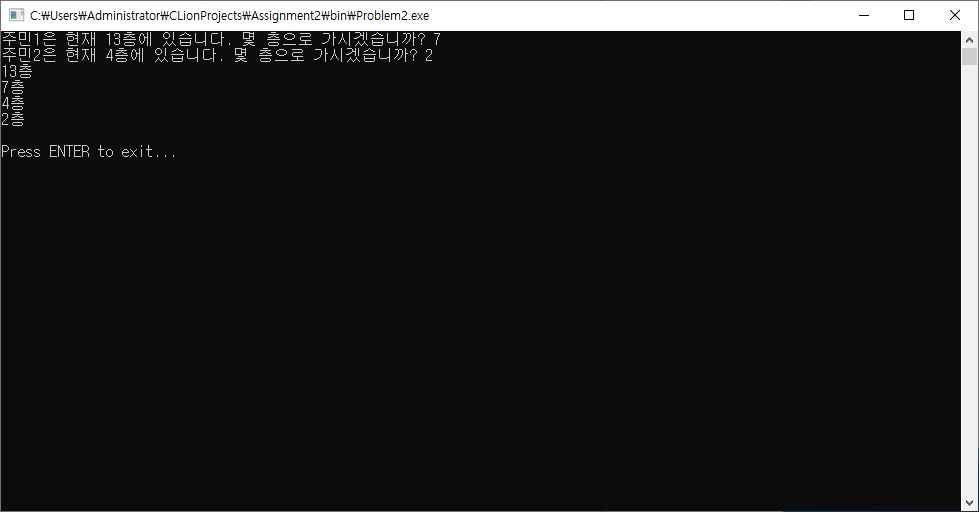
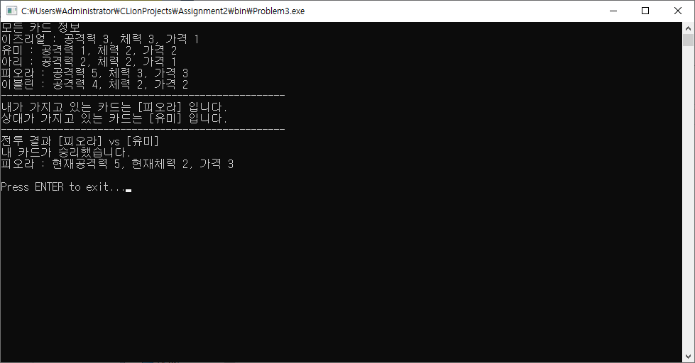
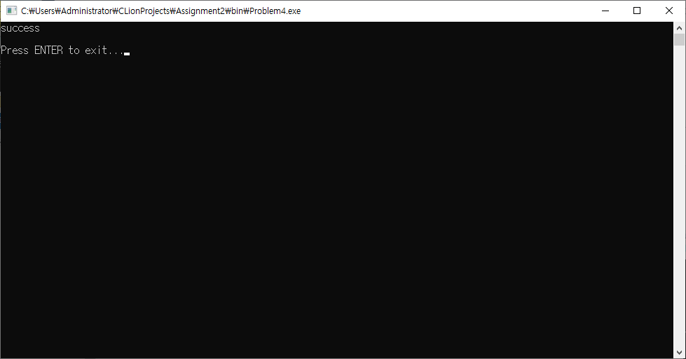
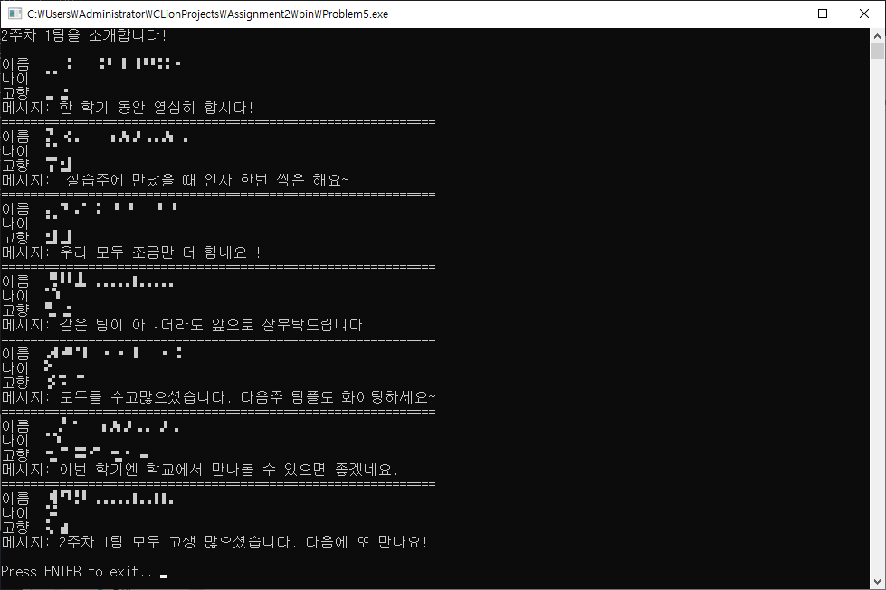

# Assignment2

## 문제
```
Problem1	Lab2-1. 엘리베이터가 멈추는 층 (팀2)
<팀 출제 문제로 풀지 않음>  Lab2-2. 카드 게임 (팀1)
Problem3	Lab2-3. 카드 배틀 게임 (김영우 조교)
Problem4	Lab2-4. 1차원 합성곱 (이재홍 조교)
Problem5	Lab2-5. 라이브러리로 협업하기 (김덕수 교수)
```

## 개발 및 컴파일 환경
Problem1과 Problem3의 경우 Windows Server 2019 + CLion + WSL(Ubuntu 18.04) + C99에서 작업되었고 GCC를 통해 i686-w64-mingw32로 윈도우용 바이너리를 크로스 컴파일하였습니다.

Problem4와 Problem5의 경우 Windows Server 2019 + Visual Studio 2019에서 x64로 컴파일되었습니다.

프로젝트 파일은 한글 출력 호환을 위해 CP949로 인코딩되었습니다.

## 빌드 방법 (Ubuntu 18.04)
### Problem1, Problem3
```
apt-get install mingw-w64
cmake CMakeLists.txt
make
```
### Problem4
[프로젝트 코드 다운로드](https://onedrive.live.com/?cid=536a6e8f3d81a30a&id=536A6E8F3D81A30A%2122267&authkey=!AGueAFvys59Ta_o)

Problem4.c의 내용이 해당 프로젝트의 main.c에 들어 갈 내용과 동일합니다.

Visual Studio x64 환경으로 컴파일합니다.

### Problem5
```
inc - 1팀 라이브러리 헤더 파일 수록
lib - 1팀 라이브러리 파일 수록
```
Visual Studio x64 환경으로 컴파일합니다.

## 구조
```
src: 문제 소스 코드 수록
bin: 크로스 컴파일된 윈도우용 바이너리 수록
inc - 1팀 라이브러리 헤더 파일 수록
lib - 1팀 라이브러리 파일 수록
report: CodeCollection, Report, Capture 수록
doxygen: 문제에 대한 Doxygen HTML Document 수록
```

## 실행 결과 캡쳐
### Problem1	Lab2-1. 엘리베이터가 멈추는 층 (팀2)

### Problem3	Lab2-3. 카드 배틀 게임 (김영우 조교)

### Problem4	Lab2-4. 1차원 합성곱 (이재홍 조교)

### Problem5	Lab2-5. 라이브러리로 협업하기 (김덕수 교수)


## 소감
4, 5번 과제 위해서 VS 설치하느라 하드가 꽉찼습니다 ㅠㅠ 가능하다면 리눅스 개발 환경 수강생도 굽어 살펴주세요


## 기타
[GitHub](https://github.com/refracta/koreatech-assignment/tree/master/CPrograming2)