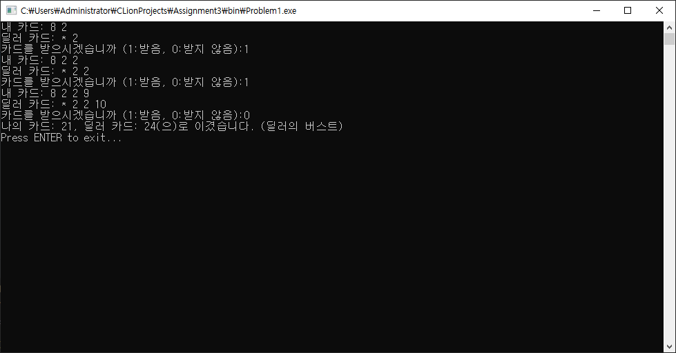
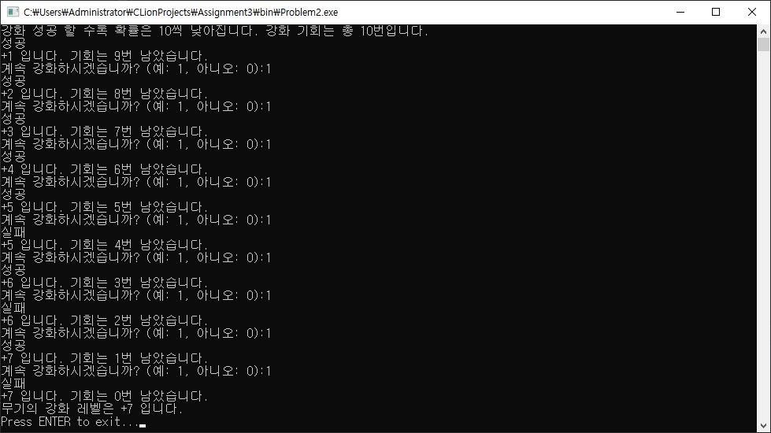
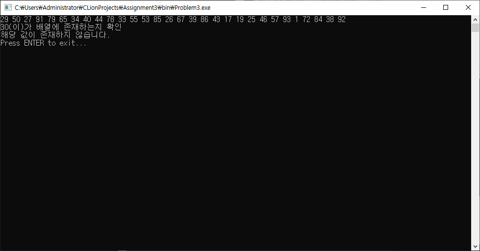
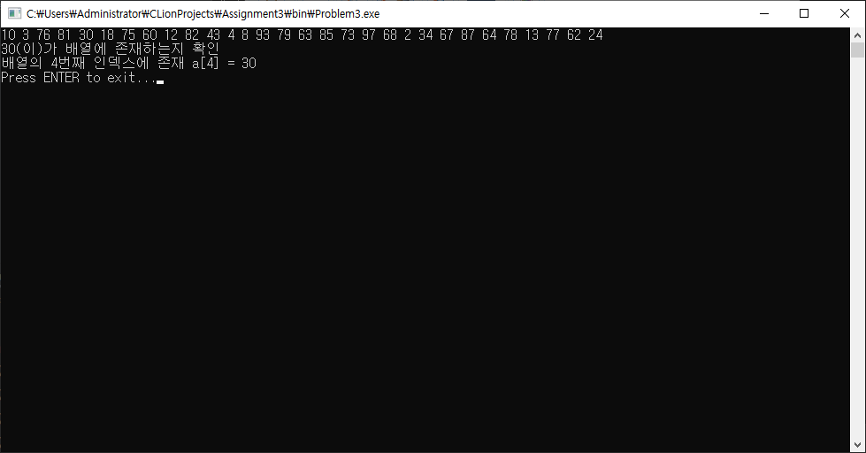
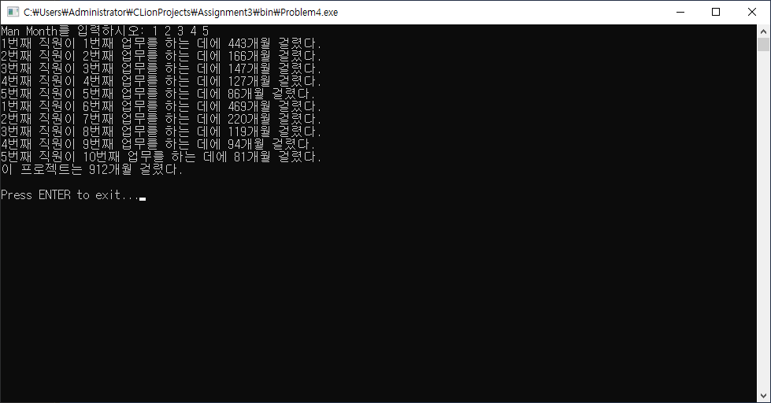
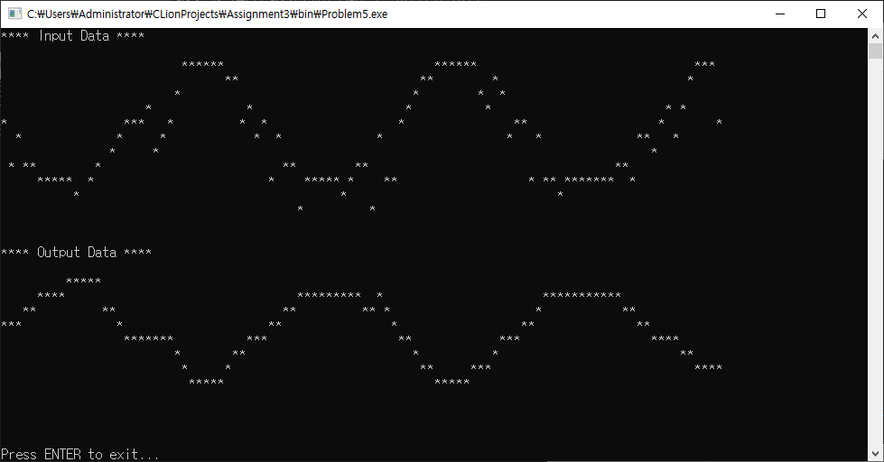

# Assignment3

## 문제
```
Lab3-1. 블랙잭（팀5)
Lab3-2. 무기강화（팀1)
Lab3-3. 카드 셔플 & 카드 찾기（김영우 조교)
Lab3-4. 이 프로젝트는 몇 달이 걸리나요? (이재홍 조교)
Lab3-5. 데이터 필터 만들기（김덕수 교수)
```

## 개발 및 컴파일 환경
Windows Server 2019 + CLion + WSL(Ubuntu 18.04) + C99에서 작업되었고 GCC를 통해 i686-w64-mingw32로 윈도우용 바이너리를 크로스 컴파일하였습니다.

프로젝트 파일은 한글 출력 호환을 위해 CP949로 인코딩되었습니다.

## 빌드 방법 (Ubuntu 18.04)
```
apt-get install mingw-w64
cmake CMakeLists.txt
make
```

## 구조
```
src: 문제 소스 코드 수록
bin: 크로스 컴파일된 윈도우용 바이너리 수록
report: CodeCollection, Report, Capture 수록
doxygen: 문제에 대한 Doxygen HTML Document 수록
```

## 실행 결과 캡쳐
### Problem1	Lab3-1. 블랙잭（팀5)

### Problem2	Lab3-2. 무기강화（팀1)

### Problem3	Lab3-3. 카드 셔플 & 카드 찾기（김영우 조교)


### Problem4	Lab3-4. 이 프로젝트는 몇 달이 걸리나요? (이재홍 조교)

### Problem5	Lab3-5. 데이터 필터 만들기（김덕수 교수)


## 소감
```
When I find my code in tons of trouble
Friends and colleagues come to me
Speaking words of wisdom
Write in C

As the deadline fast approaches
And bugs are all I can see
Somewhere someone whispers
Write in C

Write in C
Write in C
Write in C
Write in C
···
```
[Write in C](https://www.youtube.com/watch?v=XHosLhPEN3k)

## 기타
[GitHub](https://github.com/refracta/koreatech-assignment/tree/master/CPrograming2)
