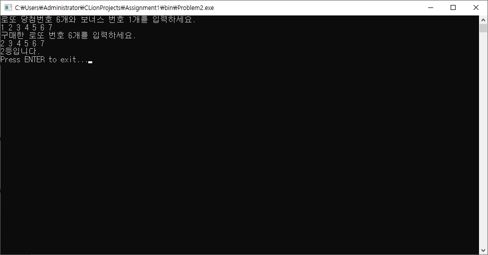
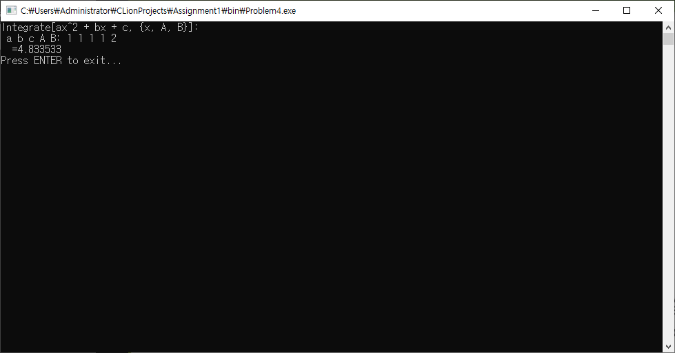
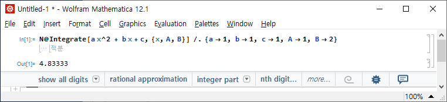
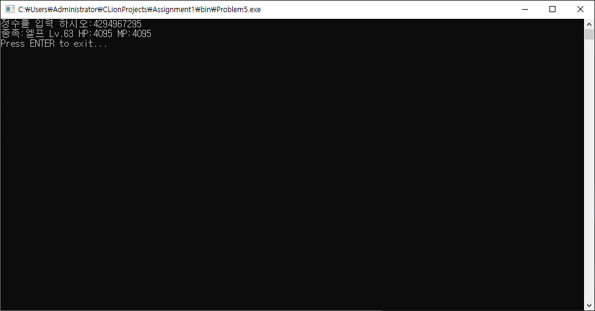

# Assignment1

## 문제
```
Problem2	Lab1-2. 로또 당첨 여부 (팀4)
Problem3	Lab1-3. 이진수 변환 (김영우 조교)
Problem4	Lab1-4. 구분구적법 (이재홍 조교)
Problem5	Lab1-5. 정수 하나에 캐릭터 정보 담기 (김덕수 교수)
```

## 개발 및 컴파일 환경
Windows Server 2019 + CLion + WSL(Ubuntu 18.04) + C99에서 작업되었고 GCC를 통해 i686-w64-mingw32로 윈도우용 바이너리를 크로스 컴파일하였습니다.

프로젝트 파일은 한글 출력 호환을 위해 CP949로 인코딩되었습니다.

## 빌드 방법 (Ubuntu 18.04)
```
apt-get install mingw-w64
cmake CMakeLists.txt
make
```

## 구조
```
src: 문제 소스 코드 수록
bin: 크로스 컴파일된 윈도우용 바이너리 수록
report: CodeCollection, Report, Capture 수록
doxygen: 문제에 대한 Doxygen HTML Document 수록
```

## 실행 결과 캡쳐
### Problem2	Lab1-2. 로또 당첨 여부 (팀4)

### Problem3	Lab1-3. 이진수 변환 (김영우 조교)

### Problem4	Lab1-4. 구분구적법 (이재홍 조교)


### Problem5	Lab1-5. 정수 하나에 캐릭터 정보 담기 (김덕수 교수)


## 기타
[GitHub](https://github.com/refracta/koreatech-assignment/tree/master/CProgramming2)
