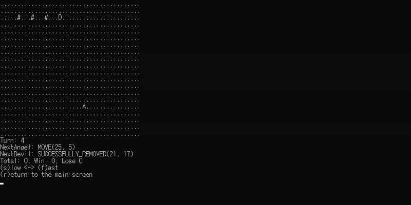

# 천사 문제
## 문제 [(PPT 바로가기)](https://docs.google.com/presentation/d/15xduJlkRDnzVd9FDZDd95TmHtPZBikqSYY3Z9HTh8oY/edit#slide=id.g9947655bd8_2_180)
[](https://youtu.be/sxiKlOK3EJY?t=0s)

> 천사 문제 (CodeParade, YouTube, 한국어 자막 有)

영상에서 제시된 것과 같이 천사가 북쪽 방향으로만 이동 가능하고 K=1일 때 직접 악마가 되어 천사를 저지하세요!

격자판은 20x41 크기이며 천사는 항상 격자판의 최하단 중앙에서 시작합니다.

## APSimulator (Angel Problem Simulator)
본 문제는 출제자가 제공하는 천사 문제 시뮬레이터 코드를 이용합니다.

해당 시뮬레이터 코드는 Windows와 Unix를 모두 지원합니다.

> ### APSimulator.h
```C
#define GRID_HEIGHT 20
#define GRID_WIDTH ((GRID_HEIGHT * 2) + 1)
// 천사와 악마가 존재하는 격자의 크기입니다. (20x41)

#define ANGEL_GLYPH 'A'
#define DEVIL_GLYPH 'D'
#define REMOVED_BLOCK_GLYPH '#'
#define EMPTY_GLYPH '.'
// 천사, 악마, 제거한 블럭, 빈 블럭의 격자칸 내부 표현 방식입니다.

int to2DX(int);
int to2DY(int);
int toIndex(int, int);
void initSimulator(int (*)(char[GRID_WIDTH][GRID_HEIGHT], int, int));
void runSimulator();
```

> ### main.c (Baseline Code)
```C
#include <stdio.h>
#include "APSimulator.h"

int controlDevil(char grid[GRID_WIDTH][GRID_HEIGHT], int angelIndex, int turn) {
    // @param grid - 좌측 하단이 [0][0]인 현재 상태 격자판입니다. 아래는 글자별 좌표 배정의 예시입니다.
    // AB A(0, 1), B(1, 1)
    // CD C(0, 0), D(0, 1)
    // 실제로는 grid에서 천사는 'A', 제거된 블록은 '#', 빈 공간은 '.'으로 표기됩니다.

    // @param angelIndex - 1차원화된 천사의 2차원 색인입니다.
    // https://ko.wikipedia.org/wiki/희소행렬 - Compressed sparse row 참조

    // @param turn - 현재 차례 수입니다.

    int x = to2DX(angelIndex);
    int y = to2DY(angelIndex);
    // 압축된 색인을 2차원 배열 색인으로 분리합니다.
    // x, y는 grid 내부에 위치한 천사의 색인입니다. 

    if(turn == 0){
        // turn은 0부터 시작합니다.
    }

    // 이 함수가 반환하는 좌표 값이 다음 차례에 악마가 제거할 블록의 위치가 됩니다.
    // toIndex(x, y) 함수로 2차원 배열 색인를 1차원 색인으로 압축하여 반환해야 합니다.
    return toIndex(turn, 16 + 1);
}

int main() {
    initSimulator(controlDevil);
    // 악마를 제어하는 함수를 매개변수로 넘기면
    runSimulator();
    // 이제 모든 것은 시뮬레이터가 알아서 합니다.
}
```

### 빠른 설치 (Command Line)
```
// Install Subversion
// Windows, https://chocolatey.org
choco install svn -y

// Linux - Debian
apt install subversion -y

// Linux - Red Hat
yum install subversion -y

// Mac
brew install subversion

// Source code download
svn export https://github.com/refracta/koreatech-assignment/branches/master/CProgramming2/MyProblem4 APSimulator
```

### 일반 설치
[소스 다운로드](https://github.com/refracta/koreatech-assignment/archive/master.zip)

> ### 방법1 (Visual Studio 2019 권장 방법)

1. 압축 해제

2. CProgramming2/MyProblem4을 원하는 위치로 이동

3. MyProblem4를 APSimulator로 이름 변경

4. Visual Studio - 로컬 폴더 열기 또는 파일 - 열기 - CMake - APSimulator/CMakeLists.txt


5. 솔루션 탐색기 - APSimulator/main.c 더블 클릭


6. 현재 문서(main.c) 클릭


> ### 방법2

1. 압축 해제

2. 본인의 프로젝트에 CProgramming2/MyProblem4 내부의 파일을 이동한 뒤 그대로 사용


### 빌드 (CMake)
```
cmake CMakeLists.txt
make
```
> WARNING: main.c 파일은 CP949로 인코딩되었으니 Linux/Mac 사용자는 유의!

## 시뮬레이터 기능 설명
### 메인 화면


시뮬레이터가 실행되면 자동 모드(a키)와 수동 모드(r키)를 선택할 수 있습니다.

c키를 눌러 시뮬레이터를 종료합니다.

### 자동 모드


자동으로 시뮬레이션을 무한 반복합니다.

천사가 탈출한 경우 자동으로 시뮬레이션 내용 전체가 실행 파일이 있는 위치에 텍스트 파일로 덤프됩니다.

[예시 덤프 파일 보기](https://github.com/refracta/koreatech-assignment/tree/master/CProgramming2/MyProblem4/dump)

s키로 느리게, f키로 빠르게 배속 조절이 가능합니다.

r키를 눌러 메인 화면으로 돌아갑니다.

### 수동 모드


수동으로 시뮬레이션을 확인합니다.

n키를 눌러 다음 차례의 모습, p키를 눌러 이전 차례의 모습을 확인 가능합니다.

d키를 눌러 실행 파일이 있는 위치에 텍스트 파일로 시뮬레이션 내용 전체를 텍스트 파일로 덤프합니다.

r키를 눌러 메인 화면으로 돌아갑니다.

### 상태(NextAngel, NextDevil)

> ### 천사 상태

 - MOVE: 다음 차례에 천사가 이동함
 - ESCAPE: 다음 차례에 천사가 격자판 밖으로 탈출함 (악마 패배)
 - STUCK: 천사가 움직이지 못하게 갇힘 (악마 승리)

>  ### 악마 상태

 - SUCCESSFULLY_REMOVED: controlDevil 함수에서 반환한 색인의 블록을 성공적으로 제거함 (다음 차례 격자판에 반영)
 - FAIL_BY_ALREADY_REMOVED_BLOCK: controlDevil 함수에서 반환한 색인의 블럭이 이미 제거된 블럭임
 - FAIL_BY_ANGEL_POSITION: controlDevil 함수에서 반환한 색인의 블럭이 천사가 있는 블럭임
 - OUT_OF_RANGE: controlDevil 함수에서 반환한 색인의 블럭이 격자판 범위 밖임

## 프로그램의 기능
주어진 천사 문제 상황에서 항상 승리하는 악마의 시뮬레이션 

## 입력 양식
없음

## 출력 양식
시뮬레이터 자동 모드에서 500회 이상을 연속 승리하면 통과입니다.

## 팁
> 악마는 디테일에 있다 (The devil is in the detail)

```
.L..................C..................R.19
..L.................C.................R..18
...###################################...17
....L...............C...............R....16
.....L..............C..............R.....15
......L.............C.............R......14
.......L............C............R.......13
........L...........C...........R........12
.........L..........C..........R.........11
..........L.........C.........R..........10
...........L........C........R...........09
............L.......C.......R............08
.............L......C......R.............07
..............L.....C.....R..............06
...............L....C....R...............05
................L...C...R................04
.................L..C..R.................03
..................L.C.R..................02
...................LCR...................01
....................A....................00
00000000000111111111122222222223333333334%%
01234556789012345678901234567890123567890%%
```


## 해설
solve.c 참조

## 참조
[Angel Problem, Wikipedia](https://en.wikipedia.org/wiki/Angel_problem)

[CodeParade - Angel Problem\[Game Theory\], YouTube](https://www.youtube.com/watch?v=sxiKlOK3EJY)

[Original Paper](http://library.msri.org/books/Book29/files/conway.pdf)

[2-Angel Proof](http://library.msri.org/books/Book29/files/conway.pdf)

