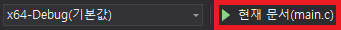

# Heuristic Search를 통한 틱택토 인공지능 만들기

## Heuristic?


휴리스틱(heuristics) 또는 발견법(發見法)이란 불충분한 시간이나 정보로 인하여 합리적인 판단을 할 수 없거나, 체계적이면서 합리적인 판단이 굳이 필요하지 않은 상황에서 사람들이 빠르게 사용할 수 있게 보다 용이하게 구성된 간편추론의 방법이다.
> #### 발견과 발명의 규칙 또는 방법을 연구하는 학문

## Tic-Tac-Toe


틱택토(tic-tac-toe)는 두 명이 번갈아가며 O와 X를 3×3 판에 써서 같은 글자를 가로, 세로, 혹은 대각선 상에 놓이도록 하는 놀이이다.

> #### 어릴 적 한번정도는 해보았던 "그 게임"

## How?
1. 틱택토 판을 평가하는 함수를 만듭니다. ([참조: 체스판 평가하기](https://github.com/refracta/koreatech-assignment/blob/master/CProgramming2/MyProblem3/README.md)) 
2. 어떤 틱택토 판에서 다음 차례의 대상이 만들 수 있는 모든 틱택토 판을 만드는 함수를 만듭니다. 

3. Minimax Algorithm (or Alpha-Beta Pruning)을 적용합니다.

> #### <del> 4. PROFIT!!! </del>

## Evaluation
인공지능이 이긴 틱택토 판의 경우는 1로 사람이 이긴 틱택토 판의 경우는 -1로 무승부를 포함한 그 외의 경우는 0으로 평가합니다.

| 경우 | 평가 값 |
|:--------:|:--------:|
| 인공지능의 승리 | 1 |
| 사람의 승리 | -1 |
| 그 외의 경우(무승부 포함) | 0 |


## Minimax Algorithm (or Alpha-Beta Pruning)
Minimax Algorithm은
[트리 구조](https://ko.wikipedia.org/wiki/%ED%8A%B8%EB%A6%AC_%EA%B5%AC%EC%A1%B0) 와 [노드](https://ko.wikipedia.org/wiki/%EB%85%B8%EB%93%9C_(%EC%BB%B4%ED%93%A8%ED%84%B0_%EA%B3%BC%ED%95%99)) 를 이용한 알고리즘으로
상대방이 최적의 판단을 한다고 가정하고 체스나 장기, 오목 같은 게임에서 인공지능가 어떤 수를 두어야 할지 결정해 주는 알고리즘 입니다. 체스나 장기같이 판을 놓고 하는 게임 외에도 수많은 인공지능 분야에서 많이 응용되는 알고리즘입니다.

[](https://youtu.be/LejUXfx9qnA?t=0s)

> Minimax Algorithm (Team Jupeter, YouTube, 한국어)


우리가 만들 틱택토 인공지능 입장에서 "현재의 상태"인 최상단 노드의 틱택토 판에서 뻗어나가는 하위 노드를 고려할 때(인공지능이 수를 두고 난 틱택토 판) 가장 평가 값이 높은 노드(인공지능이 이기고 있는 틱택토 판)를 택해야 할 것입니다. 

여기서 한번 더 뻗어나가는 하위 노드를 고려하면(사람이 수를 두고 난 틱택토 판) 상대가 게임에 최선을 다해 임한다고 가정할 때 이 하위 노드들 중에서는 가장 평가값이 낮은 노드(인공지능이 지고 있는 틱택토 판)를 택해야 할 것입니다.

이런 식으로 뻗어나가며 최하위 노드(말단 노드)에 이르게 되면 최하위 노드는 모든 격자가 채워지며 누가 이기고 졌는지, 또는 비겼는지 평가가 가능할 것입니다.

이 평가가 가능한 말단 노드로부터 그 상위 노드가 본인의 하위 노드 선택 전략에 따라 하위 노드를 결정하고 나면 이 하위 노드의 평가 값은 본인의 평가 값이 되며 결국 이 과정을 거치게 되면 최상단 노드까지 다시 돌아올 것이며 이 과정에서 바로 다음 무슨 노드를 택해야하는지 결정할 수 있게 될 것입니다.

이렇게 하위 노드로 뻗어나가면서 우리의 미래인 최선의 노드를 찾아낼 수 있는 알고리즘이 Minimax Algorithm입니다.

더 향상된 방법으로는 이전에 평가한 노드보다 형재 평가하는 노드가 더 좋지않을 가능성이 있으면 해당 노드(쓸데없는 노드)들을 가지치기하여 평가를 하지않고 성능상의 이득을 얻는 [Alpha-Beta Pruning](https://www.youtube.com/watch?v=kjBh1g5yX2M)
이 있으며 이 방법으로 문제를 해결하셔도 무방합니다.

## Problem Appeal
이 문제를 푸시면 여러분은 체스, 바둑, 오목에 대한 기초적인 인공지능을 구현하실 수 있게됩니다. 

## 문제

소개한 알고리즘을 이용하여 틱택토 인공지능을 구현하세요!

### [Minimax - Pseudocode, Wikipedia](https://en.wikipedia.org/wiki/Minimax)
```
function minimax(node, depth, maximizingPlayer)
    if depth = 0 or node is a terminal node
        return the heuristic value of node
    if maximizingPlayer
        bestValue := -∞
        for each child of node
            val := minimax(child, depth - 1, FALSE))
            bestValue := max(bestValue, val);
        return bestValue
    else
        bestValue := +∞
        for each child of node
            val := minimax(child, depth - 1, TRUE))
            bestValue := min(bestValue, val);
        return bestValue

(* Initial call for maximizing player *)
minimax(origin, depth, TRUE)
```

본 문제는 출제자가 제공하는 간이-틱택토 구현체 코드(tictactoe.c, tictactoe.h)를 사용합니다.


### tictactoe.h
```C
#include <stdio.h>
#include <stdbool.h>
#include <limits.h>
#include <stdlib.h>

#define HUMAN_SYMBOL 'O'
// 사람이 두는 수는 'O'로 표시됩니다.
#define AI_SYMBOL 'X'
// 인공지능이 두는 수는 'X'로 표시됩니다.
#define EMPTY_SYMBOL '.'
// 빈 공간은 '.'로 표시됩니다.

#define GRID_SIZE 3
#define INFINITY INT_MAX
// 무한대 대신 사용할 수 있는 상수입니다.

#define MAX(a, b) (a > b ? a : b)
#define MIN(a, b) (a > b ? b : a)
// 최대, 최소를 구할 수 있는 함수 매크로입니다.
// MIN(1, 2) = 1, MAX(2, 4) = 4

#define DRAW 0
#define AI_WIN 1
#define HUMAN_WIN 2
#define NOT_FINISHED 3
#define UNKNOWN 4
// get_grid_status에서 반환하는 상수입니다.

void copy_grid(char [GRID_SIZE][GRID_SIZE], char [GRID_SIZE][GRID_SIZE]);
// copy_grid(destination, source)로 source grid의 내용을 destination grid로 복사합니다.
void print_grid(char [GRID_SIZE][GRID_SIZE]);
// 매개변수로 받은 grid를 출력합니다.
int get_grid_status(char [GRID_SIZE][GRID_SIZE]);
// 매개변수로 받은 grid의 상태를 반환합니다.
// DRAW, AI_WIN, HUMAN_WIN, NOT_FINISHED, UNKNOWN의 5가지 경우가 있습니다.
// NOT_FINISHED는 이기지도 지지도 비기지도 않은 상태에서 반환되며
// UNKNOWN은 일반적인 틱택토 게임에서 있을 수 없는 상황에서 반환됩니다. (이 경우는 무시하여도 좋습니다)

void init_ai(void (*)(char [GRID_SIZE][GRID_SIZE]));
// 인공지능을 초기화합니다, 아래 코드에 후술
void run_tictactoe();
// 간이-틱택토 구현체 코드를 시작합니다.
```

### Baseline code (main.c)
```C
#include "tictactoe.h"

int eval_grid(char grid[GRID_SIZE][GRID_SIZE]) {
    int grid_status = get_grid_status(grid);
    /*
    switch (grid_status) {
        case AI_WIN:
            // return <?>;
        case HUMAN_WIN:
            // return <?>;
        case DRAW:
            // return <?>;
        case NOT_FINISHED:
            // return <?>;
        case UNKNOWN:
            // return <?>;
    }
    */
    // 주석을 해제하고 알맞게 구현하세요.
}

int generateGrid(char grid[GRID_SIZE][GRID_SIZE], char (*grid_array)[GRID_SIZE][GRID_SIZE], char target_symbol) {
    for (int x = 0; x < GRID_SIZE; x++) {
        for (int y = 0; y < GRID_SIZE; y++) {
            if (grid[x][y] == EMPTY_SYMBOL) {
                // copy_grid(grid_array[?], grid);
                // Your code
            }
        }
    }
    // return <real size of grid_array>;
}

char result_grid[GRID_SIZE][GRID_SIZE];
int minimax(char grid[GRID_SIZE][GRID_SIZE], int depth, int original_depth, int maximizing_player) {
    //if (depth == 0 || node_is_terminal_node) {
    //    return eval_grid(grid);
    //}
    // 주석을 해제하고 알맞게 구현하세요.
    char grid_array[GRID_SIZE * GRID_SIZE][GRID_SIZE][GRID_SIZE];
    int array_size = generateGrid(grid, grid_array, maximizing_player ? AI_SYMBOL : HUMAN_SYMBOL);
    int best_value;
    int best_grid_index;
    int is_root_node = original_depth == depth;
    if (maximizing_player) {
        best_value = -INFINITY;
        for (int i = 0; i < array_size; i++) {
            int val;
            // Your code
            if(is_root_node && val == best_value){
                best_grid_index = i;
            }
        }
    } else {
        best_value = INFINITY;
        for (int i = 0; i < array_size; i++) {
            int val;
            // Your code
            if(is_root_node && val == best_value){
                best_grid_index = i;
            }
        }
    }
    if (is_root_node) {
        copy_grid(result_grid, grid_array[best_grid_index]);
    }
    return best_value;
}

void apply_ai_selection(char grid[GRID_SIZE][GRID_SIZE]) {
    // 인공지능의 행동 함수입니다. 현재 틱택토 판을 매개변수로 받습니다.
    minimax(grid, GRID_SIZE * GRID_SIZE, GRID_SIZE * GRID_SIZE, true);
    copy_grid(grid, result_grid);
}

int main() {
    init_ai(apply_ai_selection);
    // 인공지능의 행동 함수를 매개변수로 넘기면

    run_tictactoe();
    // 이제 모든 것은 간이-틱택토 구현체가 알아서 합니다.
    // 항상 사람이 먼저 차례를 가지게 구현되었습니다.
}
```


### 빠른 설치 (Command Line)
```
// Install Subversion
// Windows, https://chocolatey.org
choco install svn -y

// Linux - Debian
apt install subversion -y

// Linux - Red Hat
yum install subversion -y

// Mac
brew install subversion

// Source code download
svn export https://github.com/refracta/koreatech-assignment/branches/master/CProgramming2/MyProblem5 TicTacToe
```

### 일반 설치
[소스 다운로드](https://github.com/refracta/koreatech-assignment/archive/master.zip)

> ### 방법1 (Visual Studio 2019 권장 방법)

1. 압축 해제

2. CProgramming2/MyProblem5을 원하는 위치로 이동

3. MyProblem5를 TicTacToe로 이름 변경

4. Visual Studio - 로컬 폴더 열기 또는 파일 - 열기 - CMake - TicTacToe/CMakeLists.txt


5. 솔루션 탐색기 - TicTacToe/main.c 더블 클릭


6. 현재 문서(main.c) 클릭



> ### 방법2

1. 압축 해제

2. 본인의 프로젝트에 CProgramming2/MyProblem5 내부의 파일을 이동한 뒤 그대로 사용


### 빌드 (CMake)
```
cmake CMakeLists.txt
make
```
> WARNING: main.c 파일은 CP949로 인코딩되었으니 Linux/Mac 사용자는 유의!

## 프로그램의 목적
배열, 포인터, 재귀함수 응용

## 프로그램의 기능
Minimax Algorithm(or Alpha-Beta Pruning)을 이용한 틱택토 인공지능 시뮬레이션

## 입력 & 출력 양식 (실행 예시)
```
<Tic-Tac-Toe>

Input ↔ Grid
1/2/3
4/5/6
7/8/9
====================
...
...
...
Next? (1~9):1
1
====================
O..
.X.
...
Next? (1~9):3
3
====================
OXO
.X.
...
Next? (1~9):8
8
====================
OXO
.XX
.O.
Next? (1~9):4
4
====================
OXO
OXX
XO.
Next? (1~9):9
9
====================
OXO
OXX
XOO

DRAW!
Process finished with exit code 0
```
1~9 사이의 숫자를 입력하여 틱택토 판에 수를 둘 수 있습니다.

틱택토는 모든 참여자가 최선을 다하면 항상 비길 수 있는 게임입니다. 항상 비길 수 있는 인공지능을 만들면 통과입니다.


## 해설
solve.c 참조

## 참조하면 좋을만한 링크들
[Tic-Tac-Toe: Understanding the Minimax Algorithm](https://www.neverstopbuilding.com/blog/minimax)

[최소 최대 알고리즘, wikidocs](https://wikidocs.net/65515)

[최대최소 알고리즘(Minimax Algorithm), tistory HA_Kwon님](https://hyeooona825.tistory.com/47)
