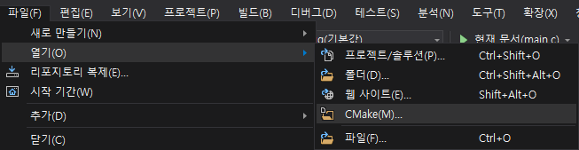

# Serial Communication with Reverse Endian Machine

## 서론


하드웨어적 설계의 차이로 당신의 컴퓨터와 다른 엔디안을 사용하는 [Embedded Machine](https://ko.wikipedia.org/wiki/%EC%9E%84%EB%B2%A0%EB%94%94%EB%93%9C_%EC%8B%9C%EC%8A%A4%ED%85%9C) 이 있습니다.

이 기계는 저성능의 기계이기 때문에 [직렬 통신](https://ko.wikipedia.org/wiki/%EC%A7%81%EB%A0%AC_%ED%86%B5%EC%8B%A0) 간 수신 데이터의 엔디안 변환이 소프트웨어적인 수준에서 지원되지 않습니다.

그러므로 이 기계가 올바르게 인식할 수 있게 데이터를 송신하려면 송신 컴퓨터 단에서의 엔디안 변환이 필요하며

이 기계는 여러분 시스템이 사용하는 엔디안과 항상 상응되는 엔디안을 가진 스펙으로 존재합니다. (Reverse Endian Machine이니까요!)

출제자가 제공하는 remscinterface.c (Reverse Endian Machine Interface) 소스 코드 상의 함수를 통해 기계와의 상호작용이 가능하며 

이 기계는 직렬 통신을 통해 문자 데이터를 수신하여 출력하는 기능이 있습니다.

* 기계의 출력 결과는 remscinterface를 통해 콘솔 출력으로 확인할 수 있습니다. (기계가 출력한 문자가 자동으로 콘솔에 출력됩니다!)


## 통신 과정

직렬 통신은 기계가 사용하는 특수한 통신 프로토콜을 통해 한번에 4바이트씩 이루어집니다.

예를들어 1바이트인 char형 데이터 2개를 직렬 통신으로 기계에 전송할 때 각 char형 데이터는 기계가 사용하는 

통신 프로토콜에 의해 4바이트짜리 단위 전송 규격으로 부호화되어 최종적으로 기계에는 부호화된 4바이트 데이터를 2번 전송하게 됩니다.

기계는 직렬 통신으로 수신한 문자 데이터를 즉시 출력하며 부호화된 데이터는 기계와 상응되는 엔디안으로 송신되고 있습니다. (이대로 전송하면 기계가 우리가 보낸 문자와 다른 값을 표시하겠죠?)

> ### 출력 예시 (잘못된 전송)
```
Current System: Little-Endian
Reverse Endian Machine: Big-Endian
Reverse Endian Machine Output: (cE220_i>g11e 0:eer1ge2d01s/C2Lp210n[2hnJi0>szU+121220kL0q0[m0g2`0u@r1R1
```

## 문제
기계가 다음 문자열을 올바르게 출력할 수 있도록 부호화된 4바이트 데이터를 기계에 맞는 엔디안으로 변환하는 함수를 구현하세요

```C
"Scheduling in Heterogeneous Computing Environments for Proximity Queries" 
```

## Baseline Code (main.c)
```C
#include <stdio.h>
#include "remscinterface.h"
#define MSG_LENGTH 72

void convert_endian(int *data) {
    // Your code!
}

int main() {
    init(convert_endian);
    // remscinterface.c의 내부 동작을 초기화하는 함수입니다.
    // remscinterface.c의 내부 함수가 우리가 구현한 convert_endian를 사용할 수 있도록 
    // 해당 함수의 포인터를 매개변수로 전달합니다.
 
    char msg[MSG_LENGTH] = "Scheduling in Heterogeneous Computing Environments for Proximity Queries";
    // = {'S', 'c', 'h', ..., 'i', 'e', 's'}; (윗줄과 동일한 코드입니다.)
    for (int i = 0; i < MSG_LENGTH; i++) {
        send_data(msg[i]);
        // 문자 데이터를 송신합니다.
    }
}
```

## 프로그램의 목적
포인터, 함수 포인터, 엔디안 강의 내용 복습 

## 프로그램의 기능
유사 직렬 통신 인터페이스를 통한 직렬 통신 시뮬레이션 

## 입력 & 출력 양식 (실행 예시)
### Little-Endian System
```
Current System: Little-Endian
Reverse Endian Machine: Big-Endian
Reverse Endian Machine Output: Scheduling in Heterogeneous Computing Environments for Proximity Queries
```

### Big-Endian System
```
Current System: Big-Endian
Reverse Endian Machine: Little-Endian
Reverse Endian Machine Output: Scheduling in Heterogeneous Computing Environments for Proximity Queries
```

## 해설
solve.c 참조

### 빠른 설치 (Command Line)
```
// Install Subversion
// Windows, https://chocolatey.org
choco install svn -y

// Linux - Debian
apt install subversion -y

// Linux - Red Hat
yum install subversion -y

// Mac
brew install subversion

// Source code download
svn export https://github.com/refracta/koreatech-assignment/branches/master/CProgramming2/MyProblem6 REMSC
```

### 일반 설치
[소스 다운로드](https://github.com/refracta/koreatech-assignment/archive/master.zip)

> ### 방법1 (Visual Studio 2019 권장 방법)

1. 압축 해제

2. CProgramming2/MyProblem6을 원하는 위치로 이동

3. MyProblem5를 REMSC로 이름 변경

4. Visual Studio - 로컬 폴더 열기 또는 파일 - 열기 - CMake - REMSC/CMakeLists.txt




5. 솔루션 탐색기 - REMSC/main.c 더블 클릭


6. 현재 문서(main.c) 클릭


> ### 방법2

1. 압축 해제

2. 본인의 프로젝트에 CProgramming2/MyProblem6 내부의 파일을 이동한 뒤 그대로 사용

### 빌드 (CMake)
```
cmake CMakeLists.txt
make
```
> WARNING: main.c 파일은 CP949로 인코딩되었으니 Linux/Mac 사용자는 유의!
